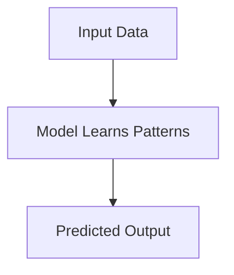
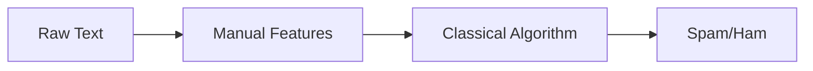
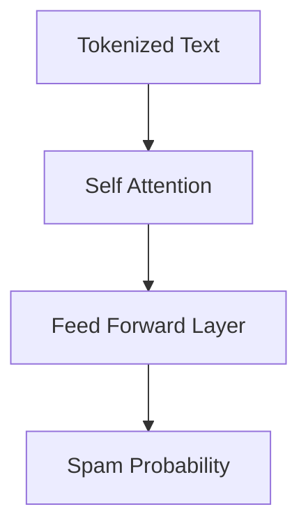
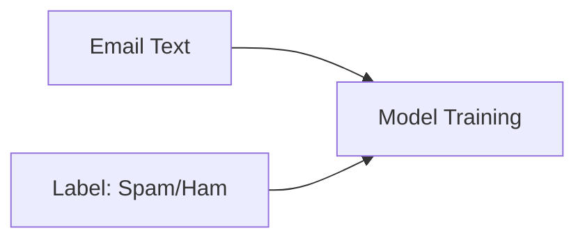

# What Is a Machine Learning Model?

At its core, a **machine learning model** is a mathematical function that maps an input to an output:



But unlike traditional programming where humans write explicit rules…

> **Machine learning models learn the rules from data.**

This is why ML is powerful: we do not manually code every condition (“If email contains the word *FREE* → spam”).  
Instead, the model analyzes thousands of examples and discovers these patterns automatically.


# Why Do We Need Models?

Models help us solve tasks too complex for rule-based programming, such as:

- Understanding natural language  
- Classifying emails as spam vs ham  
- Translating languages  
- Detecting fraud  
- Recognizing objects in images  

These tasks involve patterns that are subtle, high‑dimensional, and messy — perfect for machine learning.


# Types of Machine Learning Models

## Classical Machine Learning Models



These models rely on manually engineered features.  
Examples include:

- **Logistic Regression** – predicts binary outcomes  
- **Naïve Bayes** – very common in early spam filters  
- **Support Vector Machines (SVMs)** – strong for high‑dimensional data  
- **Decision Trees / Random Forests** – intuitive and interpretable  

Strengths:
- Fast to train  
- Work well on structured tabular data  

Limitations:
- Poor at understanding context in unstructured data (text, images, audio)  
- Require manual feature engineering  
- Struggle with long sequences  


## Neural Networks

Neural networks changed everything by learning features directly from data.

Types include:

### **Feedforward Networks (MLPs)**
- Good for simple classification tasks

### **CNNs (Convolutional Neural Networks)**
- Extremely effective for images  
- Extract spatial patterns (edges, textures)

### **RNNs (Recurrent Neural Networks)**  
### **LSTMs (Long Short-Term Memory networks)**
- Designed for sequence data such as text or speech  
- Process one token at a time  
- Understand ordering but struggle with long-term dependencies  

Limitations of RNNs/LSTMs:
- Slow to train  
- Find it hard to remember information far back in text  
- Cannot parallelize well  


## Transformers — The Modern Standard

Introduced in 2017 (“Attention Is All You Need”), Transformers became the foundation of modern AI.

They replaced RNNs by using **Self-Attention**, which allows the model to examine all words simultaneously and determine their importance to each other.



### Why Transformers Are Powerful

- They understand long-range dependencies  
- They process whole sentences in parallel  
- They scale extremely well (GPT, BERT, LLaMA)  
- They capture contextual meaning  

Example:  
In the sentence *“claim your free prize now before the offer expires”* a Transformer can detect:

- “free” → associated with spam  
- “prize” ↔ “claim” connection  
- urgency signals (“now”, “before”)  

This is why Transformers dominate NLP today.


# What Is Training Data?

Training data is the foundation of all machine learning.

Each training example includes:

- **Input** — here: the email text  
- **Output (label)** — spam (1) or ham (0)



The model looks at many examples and adjusts itself to reduce errors.  
This process is called **training**, and it uses an algorithm called **gradient descent**.

Important training concepts:

- **Training set** → used to learn patterns  
- **Validation set** → used to tune hyperparameters  
- **Test set** → used to measure performance on unseen data  

Training data quality is crucial:

> *Bad data = bad model.*


# Why the Enron Email Dataset?

The Enron dataset is historically significant:

- Comes from a real corporate environment  
- Includes authentic communication patterns  
- Contains realistic spam attempts  
- Contains internal (ham) messages  

This gives students experience with messy, real-world NLP data — not artificial, simplified examples.


# Understanding Text Representation

Machines cannot understand text directly.

We must transform text into numbers.

### Traditional Approaches
- **Bag of Words (BoW)**  
- **TF‑IDF**

Limitations:
- Lose word order  
- Ignore context  
- Struggle with synonyms

### Modern Approach: **Embeddings**

Word embeddings (like Word2Vec, GloVe, or transformer embeddings):

- Represent words as dense vectors  
- Capture semantic meaning  
- Allow computations like:  
  ```
  king - man + woman ≈ queen
  ```

In this workshop, we use **10‑dimensional embeddings** — small enough to train quickly but large enough to learn patterns.


# What Does a Transformer Model Learn in This Lab?

Your spam classifier will learn:

- Keyword patterns (“free”, “winner”, “urgent”)  
- Sentence constructions common in spam  
- Emotional tone (urgency, pressure, rewards)  
- Writing style differences between ham and spam  
- Statistical properties of spam emails  

A small Transformer can achieve surprising performance, even with low dimensions.


# The Complete Machine Learning Workflow

In this workshop you will learn every major step:

1. Explore data  
2. Visualize patterns  
3. Vectorize text  
4. Build a Transformer  
5. Train the model  
6. Validate performance  
7. Evaluate using real metrics  
8. Save your model  
9. Load it later  
10. Classify your own messages  

This is the same workflow used in real AI projects.


# What You Will Be Able to Explain After This Workshop

- What an ML model is  
- Difference between classical ML, neural networks, and transformers  
- How data is transformed into usable numerical forms  
- How training, validation, and testing work  
- What embeddings are and why they matter  
- How self-attention works  
- How deep learning learns patterns from text  
- How to evaluate a model properly  
- How to deploy a model for inference  

This foundational knowledge prepares you for more advanced NLP tasks later.