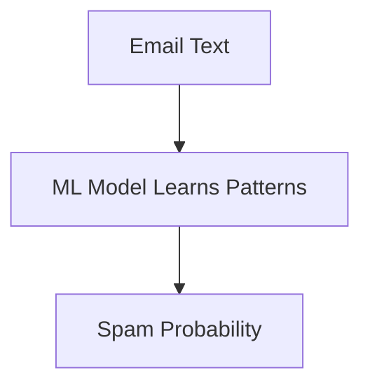
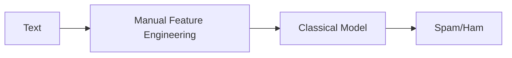
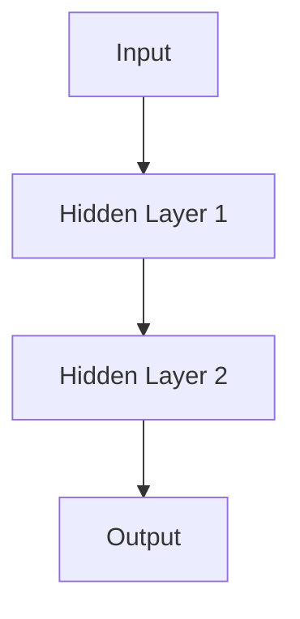
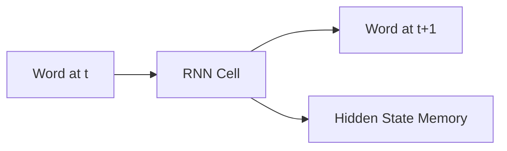
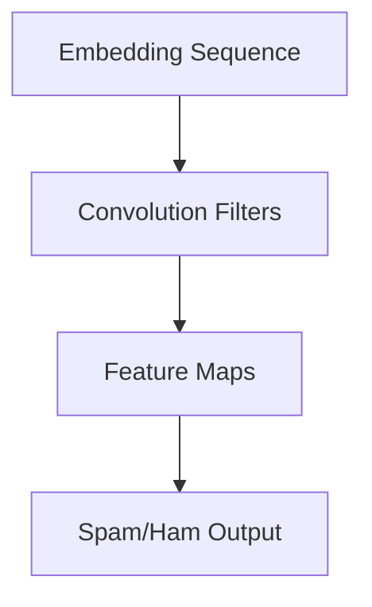
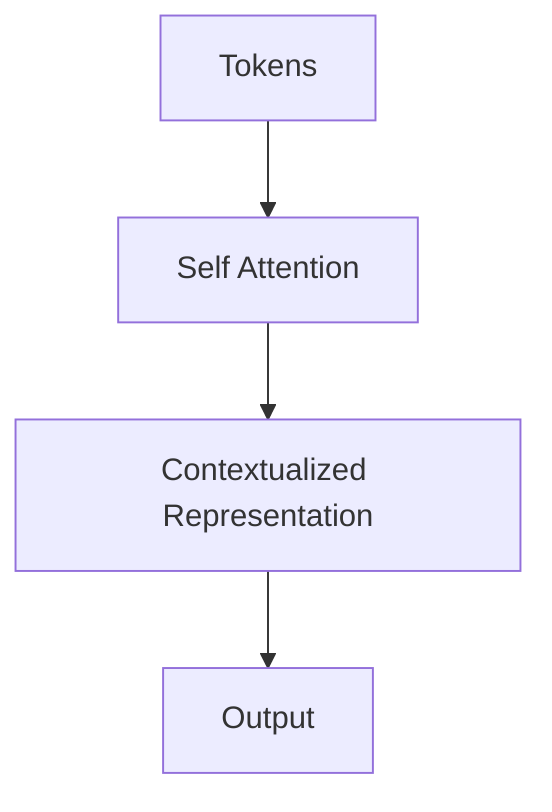

## What Is Artificial Intelligence (AI)?

Artificial Intelligence (AI) is the broad discipline focused on building systems that can perform tasks requiring human-like intelligence. These include:
- Understanding and generating language
- Recognizing objects and patterns
- Solving problems and making decisions
- Learning from data and experience

AI includes many subfields:
- Natural Language Processing (NLP)

Enables machines to understand, analyze, and generate human language.
Examples: chatbots, translation, sentiment analysis.

- Computer Vision

Allows computers to "see" and interpret images and video.
Examples: face recognition, autonomous driving, surveillance.

- Robotics

Combines perception, control, and decision-making to perform tasks autonomously.

- Expert Systems

Systems that mimic the decision-making abilities of human specialists.

**AI’s Role**
AI is not designed to replace humans, but to augment our capabilities:
- Faster decisions
- Reduced errors
- Ability to handle massive amounts of data
- Automation of repetitive tasks 
 
AI is used widely today:

| Domain         | AI Use Case                                       |
| -------------- | ------------------------------------------------- |
| Healthcare     | Diagnosis, personalized treatment, drug discovery |
| Finance        | Fraud detection, credit scoring, trading          |
| Cybersecurity  | Threat detection, anomaly detection               |
| Transportation | Route optimization, autonomous driving            |


## What Is Machine Learning? (Foundations & Intuition)
Machine Learning (ML) is a subset of AI focused on building systems that learn patterns from data rather than being explicitly programmed.

ML algorithms analyze data, detect patterns, and make predictions or decisions based on new input

**Types of ML**
- Supervised Learning (Spam Detection, Image Classification)

    - Model learns from labeled data (e.g., emails marked spam or ham).

- Unsupervised Learning (Clustering, Anomaly Detection)

    - Model finds structure in unlabeled data (e.g., customer segmentation).

- Reinforcement Learning (Robotics, Game Playing)

    - Model learns by interacting with an environment and receiving rewards or penalties.

**Practical Applications of ML**
- Medical diagnosis
- Fraud detection
- Recommendation systems
- Malware detection
- Predictive maintenance
- Autonomous vehicles

ML is the engine that enables AI systems to adapt and improve over time.

### What Is Deep Learning (DL)?

Deep Learning (DL) is a subfield of ML that uses neural networks with many layers (deep neural networks) to learn complex patterns.

**DL excels with unstructured data:**
- Text
- Images
- Audio
- Video

DL models automatically discover meaningful features — no manual engineering required.

**Key characteristics:
- Hierarchical Feature Learning

Early layers learn simple features (edges, words); deeper layers learn complex concepts (faces, sentiment, intent).

- End-to-End Learning

Model receives raw data and produces outputs directly.

- Scalability

DL models improve dramatically as data and compute increase.

**Common Deep Learning Architectures**

- **Convolutional Neural Networks:** A neural network architecture that learns hierarchical spatial features by applying shared convolutional filters over localized regions of structured input data.
- **Recurrent Neural Networks:** A neural network designed to model sequential data by maintaining and updating an internal state that captures temporal dependencies across ordered inputs.
- **Transformers:** A neural network architecture that models relationships within a sequence using self-attention mechanisms to capture global contextual dependencies without relying on recurrence or convolution.

| Model Type       | Best For                      | Why                                         |
| ---------------- | ----------------------------- | ------------------------------------------- |
| **CNNs**         | Images, spatial data          | Detect local patterns & spatial hierarchies |
| **RNNs**         | Sequences                     | Handle ordered, time-dependent data         |
| **LSTMs / GRUs** | Long text sequences           | Better long-term memory                     |
| **Transformers** | NLP, vision, multimodal tasks | Self-attention enables global reasoning     |

Transformers are now the dominant architecture across NLP and many other ML tasks.

### Relationship Between AI, ML, and DL
Here is the hierarchy:
```text
Artificial Intelligence (AI)
    └── Machine Learning (ML)
          └── Deep Learning (DL)
```

**Examples of the hierarchy at work**
- In Computer Vision, Deep CNNs dominate image classification.
- In NLP, transformers like BERT and GPT outperform all prior ML models.
- In Autonomous Driving, ML + DL work together:
  - ML for prediction models
  - DL for perception (lanes, objects)

### Bringing It Back to This Workshop
You will work primarily with:
- Machine Learning (ML) for classifying emails
- Deep Learning (DL) using neural networks
- Transformers as the modern backbone of NLP

In this lab, we will use SPAM detection as a great example because it requires:
- Understanding language
- Detecting subtle patterns
- Learning from real-world data
- Generalizing to new emails
- Adapting to evolving spam tactics

By the end of this workshop, you'll understand how to build an AI system that performs a real-world NLP task using modern deep learning methods.


### Why Machine Learning Exists
Traditional programming requires humans to create explicit rules.  
This fails in real-world tasks with high variability, such as spam detection.

```text
IF email contains "FREE" → spam
```

This breaks immediately when:
- Spammers change vocabulary
- New fraud techniques appear
- Grammar, language, and tone vary

Machine learning solves this by learning rules from examples, not from humans.



ML models learn patterns automatically instead of relying on rigid rules. Also the model discovers statistical regularities humans never coded.

### How Models Learn
All ML models follow this loop:
1. Input → text
2. Model predicts → probability of spam
3. Loss function → evaluates how wrong the prediction was
4. Backpropagation → computes how each weight influenced error
5. Gradient descent → updates weights to reduce future errors

Repeating this process thousands of times makes the model learn.

### Mathematics (Simple Intuition)
A model is a function:
```math
$$y=f(x)$$
```

Training aims to minimize:

```math
$$
\mathrm{Loss} = \frac{1}{n}\sum_{i=1}^{n}\left(y_i - \hat{y}_i\right)^2
$$
```

The optimizer adjusts parameters:
```math
$$
\theta_{\text{new}} = \theta_{\text{old}} - \alpha \frac{\partial \mathrm{Loss}}{\partial \theta}
$$
```

### Generalization, Underfitting, Overfitting
Underfitting
- Model too simple
- Fails to learn patterns

Overfitting
- Memorizes training examples
- Performs poorly on unseen data

Generalization
- Learns underlying structure
- Performs well on new data

Concept drift
- Real-world patterns change (spam evolves)
- Model must be retrained periodically


## Types of Machine Learning Models

In this chapter we will go over the following topics:
- Understand classical ML vs deep learning
- Explain manual vs learned features
- Understand the limitations of traditional NLP methods

### Classical Machine Learning
Classical ML models include:
- Logistic Regression
- Naive Bayes
- Support Vector Machines
- Decision Trees / Random Forests

They rely heavily on manual feature engineering (TF-IDF, Bag-of-Words).



Strengths
- Simple
- Fast
- Works well on structured data

Weaknesses
- Cannot understand meaning
- Word order ignored
- Cannot capture context
- Struggles with long sequences

### Why Classical ML Fails for Real NLP
Example:
- “You won a free iPhone!”
- “Claim your reward now!”

A TF-IDF model sees:
- Completely different words
- No connection between concepts (“won”, “reward”)

ML fails because meaning ≠ word counts.
Deep learning models solved this gap.


## Neural Networks: Core Concepts

In this chapter we will go over the following topics:
- Understand neurons, layers, weights, and activations
- Learn how backpropagation works
- Understand hierarchical feature learning

### What Is a Neural Network?
A neural network is a series of learned transformations.
Example for a chain of transformations:


Each neuron computes:
```math
$$a=σ(Wx+b)$$
```

### Hierarchical Learning
Deep networks build layers of understanding:
- Layer 1 → edges, patterns, keywords
- Layer 2 → sentiment, tone, syntax
- Layer 3 → intent, meaning (fraud, manipulation)

This hierarchical learning makes deep networks extremely powerful.


### How Neural Networks Learn

Neural networks adjust millions of weights using backpropagation.
Each weight is updated by how much it contributed to the model’s error.

This allows the network to gradually shift from random noise to pattern recognition.

## Sequence Models: RNN, LSTM, GRU

In this chapter we will go over the following topics:
- Understand why sequential models were needed
- Learn how RNNs build memory
- Understand LSTM and GRU gating mechanisms
- Recognize bottlenecks that transformers eliminate

### RNN — Recurrent Neural Networks

RNNs introduced the idea of time-dependent memory:


They track previous context using a hidden state.

Weaknesses
- Vanishing gradients
- Slow (sequential processing)
- Struggles with long-range patterns

### LSTM — Long Short-Term Memory
LSTMs added gates (input, forget, output) to regulate information flow.

This allowed:
- Better long-term memory
- Less catastrophic forgetting

For years, LSTMs were the backbone of NLP.

### GRU — Gated Recurrent Unit
A simpler LSTM:
- Fewer gates
- Faster to train
- Slightly less expressive

### Why Sequence Models Broke at Scale

- Cannot parallelize
- Slow to train on large datasets
- Memory bottlenecks
- Poor long-term reasoning

These limitations motivated the invention of transformers.

## CNNs & Feedforward Networks

In this chapter we will go over the following topics:
- Understand why CNNs work for textual patterns
- Explain feature maps
- Know their limits


### Feedforward Networks (MLPs)
MLPs treat input as fixed-length vectors.
They ignore order, structure, and variable sequence length.

### CNNs — Convolutional Neural Networks

CNNs slide filters across sequences to detect local patterns:



CNNs detect:
- "free offer"
- "click now"
- "urgent response"

Weaknesses
- They do not understand long-range dependencies.


## Transformers & Self-Attention

In this chapter we will go over the following topics:
- Understand self-attention
- Compare transformers with RNN/LSTM
- Learn why transformers dominate NLP today

### The Self-Attention Mechanism

Transformers compare each word with every other word:



This allows the model to discover relationships instantly.

Example spam email:
```text
Claim your free prize now before the offer expires.
```

Attention detects:
- free ↔ prize
- offer ↔ expires
- urgency patterns

### Multi-Head Attention
Each head focuses on a different pattern:
- Head 1 → urgency
- Head 2 → reward structures
- Head 3 → threat/pressure

This parallel interpretation is why transformers are so strong.

### Why Transformers Replaced LSTMs

| Feature           | LSTM       | Transformer      |
| ----------------- | ---------- | ---------------- |
| Reads tokens      | sequential | parallel         |
| Long-range memory | limited    | excellent        |
| Training speed    | slow       | fast             |
| Scalability       | low        | extremely high   |
| NLP performance   | outdated   | state-of-the-art |


## Embeddings & Representation Learning
In this chapter we will go over the following topics:
- Understand why text → numbers
- Learn how embeddings encode meaning
- Explain vector similarity

### Why Text Must Be Converted Into Numbers
Neural networks require numeric vectors.
Embeddings map words to dense vectors:
```text
"free" → [0.2, -0.7, 0.1, ...]
"winner" → [0.25, -0.82, 0.06, ...]
```

### Semantic Vector Spaces
Embeddings encode meaning via relative positions:
```text
king - man + woman ≈ queen
free + prize + claim ≈ spam-like semantics
```
This allows models to:
- Generalize
- Understand synonyms
- Capture context

### Embeddings Learned in This Workshop
Your model learns 10-dimensional embeddings from the dataset.
They become specialized for spam semantics, such as:
- urgency
- reward
- threats
- scam structure