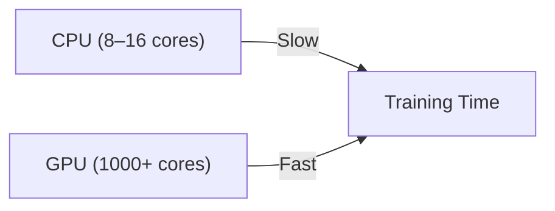

## Setup Google Colab

For this lab we will use [Google Colab](https://colab.google/). Google Colab has many advantages over using our own hardware for this lab:

- Free access to GPUs (at least sometimes)  
- Zero installation overhead  
- Ready-to-use scientific Python stack  
- Cloud execution  
- Notebook interface for interactive learning  

This allows you to have a stable environment including powerfull hardware to train a machine learning model.

{}
If you have strict blocking of site cookies, you may have an issue running the Javascript necessary to run the Colab pages and render graphs.  You may have to temporarily change you cookie settings in your browser.  
{}

{}
You can still run this lab on your local machine if you prefer. However, it is recommended to use a Mac with an M-series chip or a Linux Machine. (This has not been tested on Windows!)
In addition, it is strongly recommende to setup a Python virtual environment to avoid dependency conflicts with other Python projects on your machine.
{}

To use Google Colab, a Google Account is required (it doesn't matter if this is your coporate or private one).

1. Go to https://colab.research.google.com/
2. Login to Google Colab by selecting the `Sign In` button at the top right corner


3. Select `+ New notebook` in the Wizard


4. Now you should be able to access the Jupyter Notebook which allows to follow along with the lab.


{}
In case your session did expire or times out, you will need to re-run the code from the beginning to reinstall the dependencies and initilize everything.
{}

{}
In every chapter/step you will find code snippets starting with `#@title ...`. You can copy and paste these code snippets into a code cell in your Colab notebook to run them. If there is a code snippet without this, it is used to explain some functionality and does not need to be copied.
{}
## Setup dependencies

The ML Software Stack we will use in this lab consists of the following components:
- TensorFlow  
Provides automatic differentiation, GPU computation, and model building tools.
- Keras  
A high-level API that makes deep learning intuitive.
- HuggingFace Datasets  
Enables easy loading and preprocessing of datasets.
- NumPy & Pandas  
Used for numerical operations and tabular views.


Use the below code snippet to install and import the required dependencies in your Colab environment.
```python
#@title Setup dependencies
!pip install -q datasets

import os
import numpy as np
import pandas as pd
import matplotlib.pyplot as plt

import tensorflow as tf
from tensorflow import keras
from tensorflow.keras import layers

from datasets import load_dataset
from sklearn.metrics import classification_report, confusion_matrix
```

### Validate if a GPU is available
GPUs accelerate deep learning dramatically:



Neural networks = millions of matrix multiplications  
This results in: GPUs = massive speed boost.

Use the below code snippet to check if a GPU is available in your Colab environment.
```python
#@title Check GPU
device_name = tf.test.gpu_device_name()
if device_name:
    print("✅ GPU available:", device_name)
else:
    print("⚠️ No GPU detected. Training will still work, but slower.")
```
{}
The free version of Google Colab does not guarantee GPU availability at all times. If no GPU is detected, you can try to enable it by going to `Runtime` -> `Change runtime type` and selecting `GPU` as the hardware accelerator. However, GPU availability may still be limited based on demand and usage policies.
You can ignore this warning and continue with the lab, but training times will be significantly longer without a GPU.
{}