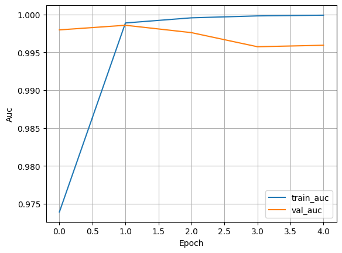
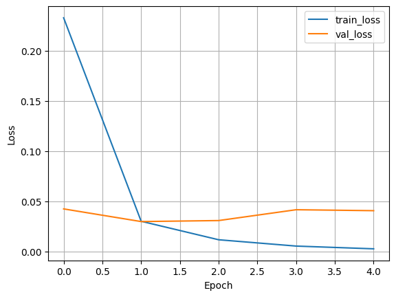

## Compile the Model

```python
#@title Compile model

learning_rate = 1e-3  # students can tune (= 0.001)

model.compile(
    optimizer=keras.optimizers.Adam(learning_rate=learning_rate),
    loss="binary_crossentropy",
    metrics=[
        "accuracy",
        keras.metrics.AUC(name="auc"),
    ],
)
```
`model.compile(...)` tells Keras:
- how to update the model (optimizer)
- how to measure errors (loss function)
- which metrics to compute during training/evaluation

It does not start training yet – it just configures the training procedure.

#### Learning rate
```python
learning_rate = 1e-3  # = 0.001
```
The learning rate controls how big the steps are in gradient descent.
- Too high → model jumps around, may never converge
- Too low → training is very slow, may get stuck in a bad spot

Here: 1e-3 is a common default starting point.

#### Optimizer: Adam

An optimizer tells the model how to update weights to reduce the loss using gradients.

```python
optimizer=keras.optimizers.Adam(learning_rate=learning_rate)
```

The Adam optimizer is great default optimizer to start with. It provides some cabapilities like:
- Adaptive learning rates per parameter
- Works well for many NLP and deep learning tasks
- Handles noisy gradients better than vanilla SGD

#### Loss Function: Binary Crossentropy
The loss measures how far the predictions are from the true labels.  It’s what the optimizer tries to minimize.

```python
loss="binary_crossentropy",
```
We have choosen the `binary_crossentropy` because of:
- We have a binary classification problem: spam (1) vs ham (0)
- Output is a single probability (sigmoid)
- Binary crossentropy is the standard choice for this setup

#### Metrics: Accuracy and AUC

Metrics are readable performance indicators shown during training.  Unlike the loss, we don’t optimize them directly; we just track them.
- Accuracy – how many predictions are correct (simple and intuitive)
- AUC (Area Under ROC Curve) – how well the model separates spam vs ham across thresholds

AUC is great in this case due to Spam detection is often about ranking messages by risk, not just picking a fixed threshold.
AUC gives a good idea of separability even if the class distribution is imbalanced.

```python
metrics=[
    "accuracy",
    keras.metrics.AUC(name="auc"),
],
```

## Train the Transformer model

In this step you will start with the training of the model. In this step, you can tweak/tune the training by adjusting the `epoch` parameter. An epoch is one full pass over the training dataset.

```python
#@title Train the Transformer model

epochs = 1  # this can be tuned

history = model.fit(
    train_ds,
    validation_data=val_ds,
    epochs=epochs,
)
```

The real magic happens during the `model.fit(...)` call.
What happens during the call for each epoch:
- The model iterates over train_ds
- For each batch:
  - makes predictions
  - computes loss
  - computes gradients
  - updates weights via the optimizer
- After an epoch, it evaluates on `val_ds` to measure generalization

With the submission of the `validation_data` we make sure not to overfit the model.

{}
Note: this step may take a while - lay back and grab a coffe or have a chat with you colleagues :-)
{}

## Analyse the training progress

This step is purly for your evaluation of the training progress. Let's get an overview on whats good and whats bad:

### Accuracy
- train_accuracy describes how well the model fits the training data
- val_accuracy describes how well it generalizes to unseen data

**Good sign:** both curves rising and staying reasonably close

**Overfitting sign:** training goes up, validation gets worse or stagnates
### AUC
- Higher AUC describes the model is better at distinguishing spam vs ham
- AUC is especially useful when the classes are imbalanced

### Loss
- train_loss should go down as the model learns
- val_loss ideally also decreases, then stabilizes

If the train_loss keeps decreasing and val_loss starts increasing after some epoch this would indicate a strong overfitting.

```python
#@title Plot training curves

def plot_history(history, metric="accuracy"):
    plt.figure()
    plt.plot(history.history[metric], label=f"train_{metric}")
    plt.plot(history.history[f"val_{metric}"], label=f"val_{metric}")
    plt.xlabel("Epoch")
    plt.ylabel(metric.capitalize())
    plt.legend()
    plt.grid(True)
    plt.show()

plot_history(history, "accuracy")
plot_history(history, "auc")
plot_history(history, "loss")
```

#### Examples


