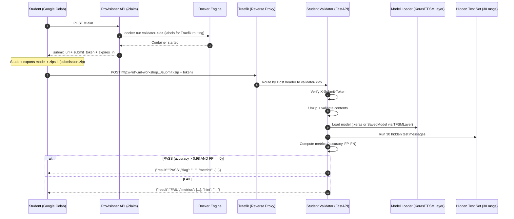

# Workshop Validation Server Application

The validation system is designed to provide each student with an **isolated, on-demand validator environment** that securely evaluates submitted models against a hidden test set.

## How it works


### How the validation server works
1. Claiming a personal validator

    Each student starts by calling the Provisioner API (`POST /claim).	

    The provisioner launches a dedicated validator container (`validator-<id>) and configures Traefik routing so that the student receives a unique endpoint such as: `http://<id>.ml-workshop.ftntlab.tech/submit`
    
    Per-student submission token is generated to prevent cross-submissions.
2. Model export and submission

    Students export their trained transformer model, zip the artifact, and upload it to their personal validation endpoint.

    The request includes the submission token in the X-Submit-Token HTTP header.
3. Secure validation against hidden tests

    Inside the validator container:
    - The submission token is verified.
    - the ZIP file is extracted safely (path traversal and size limits enforced)
    - the model is loaded (.keras format or TensorFlow SavedModel via TFSMLayer)
    - the model is evaluated on 30 hidden test messages
    - evaluation metrics are computed (detection rate, false positives, false negatives)

4. Pass / fail decision

    The validator applies strict acceptance criteria:
    - Detection rate > 98%
    - Zero false positives

If both conditions are met, the validator returns a flag.
Otherwise, it returns a detailed metrics report and a hint, allowing the student to improve and resubmit.

## How to setup
### Requirements
- Docker & Docker compose
- Custom domain records:
  - `your-subdomain.your-domain.com` pointing to your server's IP address
  - `*.your-subdomain.your-domain.com` pointing to your server's IP address

### Setup
1. adjust the domain values in the `docker-compose.yml` file
   - `WORKSHOP_DOMAIN`
   - `FLAG_PREFIX`
2. Build the validator Docker image:
   ```bash
   docker build --no-cache -t workshop-validator-validator:latest ./validator
   ```
3. Start and build the application using Docker Compose:
   ```bash
   docker compose up -d --build
    ```